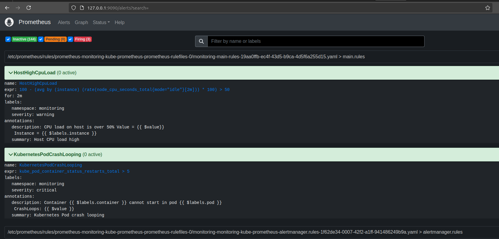
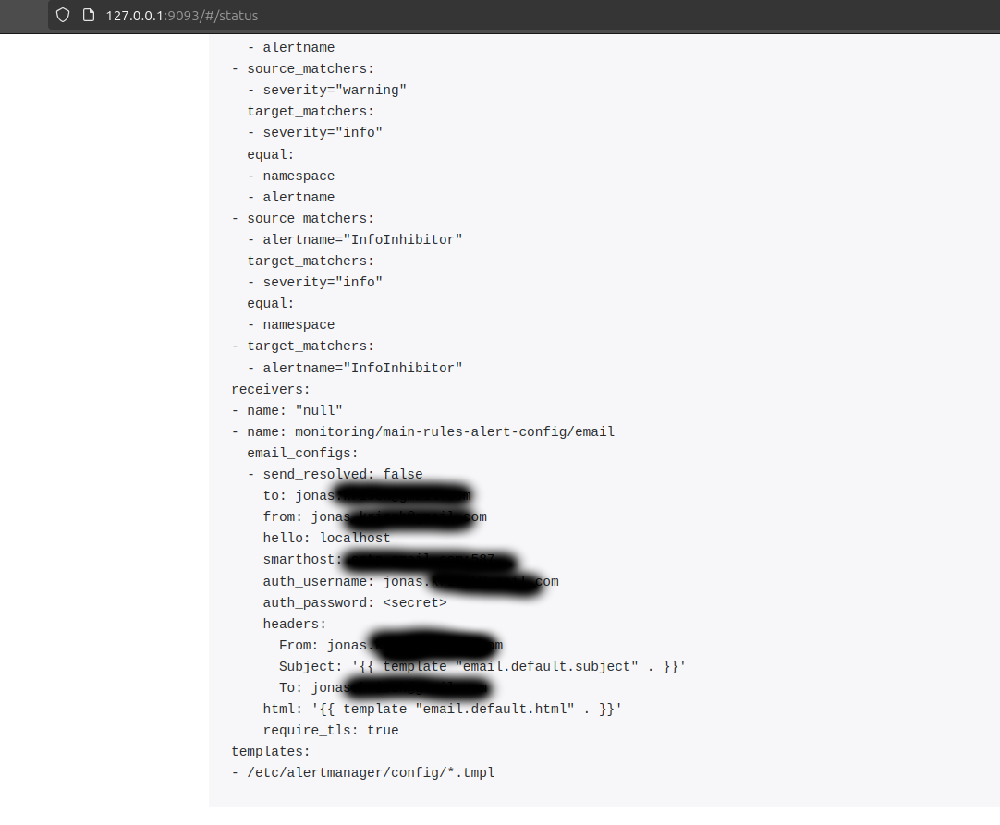
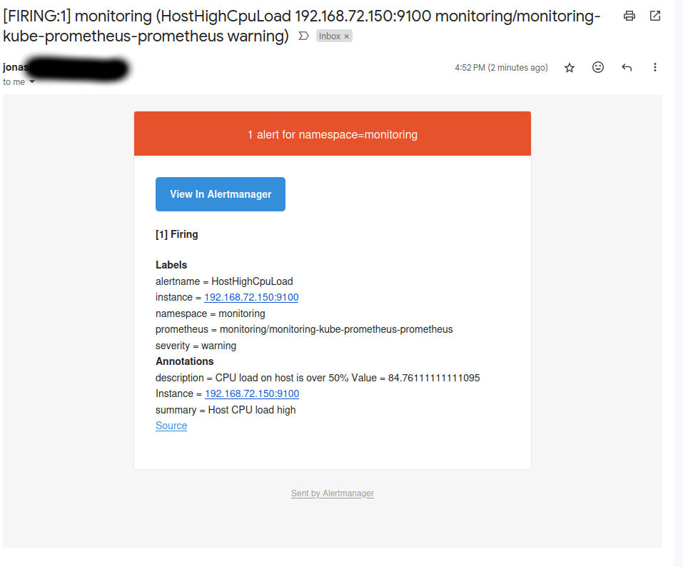
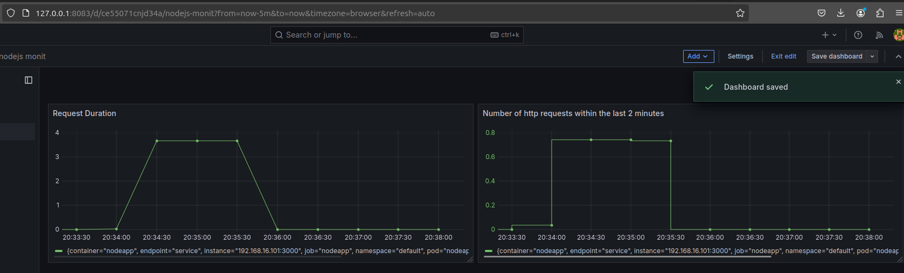

# Lecture 16 Monitoring and Alerting with Prometheus and Grafana

## Deploy Prometheus to kubernetes cluster
There are different approaches to deploy the prometheus stack in k8s.

```
1. Create all config yaml files yourself and apply them in the *right* order
    - this is very inefficient and comes with a lot of effort
2. Using an operator
    - the operator can be seen as a orchestrator of all prometheus components
    - manages the combination of all components as one unit
    - find an operator
    - deploy it in the k8s cluster using the config files of the operator
3. Using helm chart to deploy operator
    - Maintained by the prometheus community
```

We use the third Option.
Create the cluster using eksctl and apply the microservices app config

```bash
eksctl create cluster
kubectl apply -f ../Lecture-10/microservice-app/config.yaml
```

Then add the prometheus community repo and install the kube-prometheus-stack helm chart:
```bash
helm repo add prometheus-community https://prometheus-community.github.io/helm-charts
helm repo update
kubectl create namespace monitoring
helm install monitoring prometheus-community/kube-prometheus-stack -n monitoring
```

What the helm chart then deploys are:
```
* 2 Statefulsets
    * Core Prometheus-Server
    * Alertmanager
* 3 Deployments
    * Prometheus Operator
    * Grafana
    * Kube State Metrics
        * own helm chart (dependency of the prometheus chart)
        * scrapes k8s components (deployments, statefulsets, pods, etc)
* 1 DaemonSet
    * Node Exporter DaemonSet
        * DaemonSet runs on every k8s node
        * Connects to the server and translates the node metrics to prometheus metrics (CPU usage, memory usage, etc.)
* Pods, Services, etc.
```

To access the prometheus Web UI we need the service for the web ui we can expose the respective service:
``` bash
kubectl port-forward -n monitoring services/monitoring-kube-prometheus-prometheus 9090:9090 &
```

For grafana we expose the respective service:
```bash
kubectl port-forward -n monitoring services/monitoring-grafana 8083:80
```

## Alert rules
Create rules for

```
1. Alert when CPU usage > 50%
2. Alert when Pod cannot start
```

### Create Rule

first rule explained
```
100 - (avg by(instance) (rate(node_cpu_seconds_total{mode="idle"}[2m])) * 100) > 50
```

node_cpu_seconds_total{mode="idle"}[2m]: gives back the amount of CPU time spent in mode idle over the last 2 minutes
rate (node_cpu_seconds_total{mode="idle"}[2m]): average amount of CPU time spent in mode idle over the last 2 minutes
avg by(instance) : groups it by instance
To get a percentage value multiply it by 100.

Substracting this from 100 gives back the total cpu usage over the last minutes

### Deploy rule
To deploy the rule we can use the newly created (by prometheus stack) custom resource definition (k8s api extension) as we are running the prometheus stack (including the operator etc.) within k8s.
If prometheus would run outside the cluster not using any operator we would need to put the file in the rules directory and restart prometheus.

```yaml
labels:
    app: kube-prometheus-stack
    release: monitoring
```
Is needed for PrometheusRule so that k8s can identify which resource should the config applied to so that prometheus operator can pick the rules up.
After applying the file using
```bash
kubectl apply -f alert-rules.yaml
```
The rules get created:



We can also check the logs of the sitecar container (whichs only purpose is to reload the config):
```bash
kubectl logs prometheus-monitoring-kube-prometheus-prometheus-0 -n monitoring -c config-reloader
```
```
level=info ts=2024-11-24T14:45:09.817211298Z caller=reloader.go:548 msg="Reload triggered" cfg_in=/etc/prometheus/config/prometheus.yaml.gz cfg_out=/etc/prometheus/config_out/prometheus.env.yaml cfg_dirs= watched_dirs=/etc/prometheus/rules/prometheus-monitoring-kube-prometheus-prometheus-rulefiles-0
```

### Trigger alert
To trigger the first rule we deploy a pod to the cluster which simulates the cpu load.

```bash
kubectl run cpu-test --image containerstack/cpustress -- --cpu 4 --timeout 60s --metrics-brief
```

where '-- ' for kubectl gives the oportunity to pass options to kubectl (like in docker)

To expose the alert manager ui:
```bash
kubectl port-forward svc/monitoring-kube-prometheus-alertmanager -n monitoring 9093:9093 &
```

After applying the secret and the alertmanagerconfig we see in the alertmanager ui that the config has changed:



And after triggering the alert we also receive the email:



To check the alerts we can also check the endpoint on the alertmanager: /api/v2/alerts


### Third party apps monitoring
#### deploy redis exporter
To get metrics from a third party app (e.g. redis) we need an exporter.
An exporter
* gets metrics data from the service
* translates these service specific metrics so that prometheus understands them
* exposes these translated metrics under a /metrics endpoint

For this we need the exporter and a Service Monitor custom recource

We use helm to deploy the redis exporter:
```bash
helm install redis-exporter prometheus-community/prometheus-redis-exporter -f redis-values.yaml
```

Grab some rules from:
(https://samber.github.io/awesome-prometheus-alerts/rules#redis)
and put them into [the alert file for redis](./redis-alert-rules.yaml)

#### create grafana dashboard
Import the grafana dashboard from (https://grafana.com/grafana/dashboards/11835-redis-dashboard-for-prometheus-redis-exporter-helm-stable-redis-ha/)


### Monitor your own application
After the /metrics endpoint has been defined using prometheus client for nodejs we can deploy the app, the service and the service monitor using the [config file](./demo-app-k8s-conig.yaml).
Before we apply we need to create the secrets:
```bash
 kubectl create secret docker-registry my-registry-key --docker-username=jaykay84 --docker-password=$MYDOCKERPASS
 kubectl apply -f demo-app-k8s-config.yaml
 ```
For prometheus to pick up the target we need to add:
```yaml
metadata:
  labels:
    release: monitoring
```

 In case the service is in another namespace than the prometheus stack we need to add:
 ```yaml
 namespaceSelector:
    matchNames:
    - default
```

After creating the dashboard and using the expression:
```
rate(http_request_duration_seconds_count[2m])
```
we retrieve the following dashboard:



